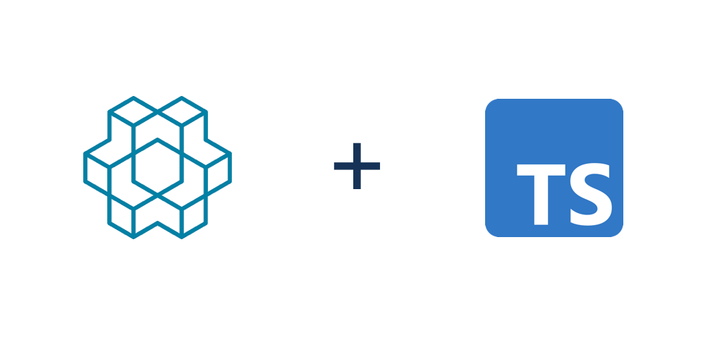

# RL.ts - A Reinforcement Learning Library in Typescript 🤖

<!--  -->

[](https://badge.fury.io/js/rl-ts)

RL.ts is a RL gym and library built with **typescript** on top of [TensorFlow.js](https://www.tensorflow.org/js), enabling faster bug-free development, powerful web visuals, and a gateway to developing and comparing reinforcement learning algorithms on the web and / or with node.js in javascript or typescript.


**Table of Contents**
- [Features](#features)
- [Installation](#installation)
- [Getting Started](#getting-started)
- [Comparisons with Other Libraries](#comparisons-with-other-libraries)
- [Development](#development)

## Features

- Uses a **Open AI Gym** like interface to provide an accessible and general approach for developing environments and testing algorithms

- Provides [standard integrated environments](https://github.com/StoneT2000/rl-ts/tree/main/src/RL/Environments) like **CartPole** and **GridWorld**

- Provides a toolbox of baseline algorithms such as **Deep Q Networks (DQN)**, **Policy Gradient methods**, as well as other algorithms like policy iteration.

- **typescript** means types, less bugs, and powerful, easily buildable, visuals.

Why RL with typescript / javascript (TS/JS)? TS/JS powers the web and a ton of the awesome visuals you see online.
While indeed production level reinforcement deep learning should be done with python / C++, TS/JS makes it easy to directly integrate RL into the browser and serve not only as a simple integration for visualizers, but also as a powerful web-based teaching tool on RL. Moreover, this library can help developers with a background in TS/JS ease their way into learning reinforcement learning.

## Installation

Install with

```
npm install rl-ts
```

It is also recommended to install [numjs](https://github.com/nicolaspanel/numjs) via

```
npm i github:nicolaspanel/numjs
```

as many computations are performed with NdArrays (provided by the numjs package).

## Getting Started

This library contains both integrated environments and various algorithms. Feel free to dive head first into code and running of algorithms if you like. It is recommended to get a basic understanding of RL and https://spinningup.openai.com/en/latest/spinningup/rl_intro.html is a great intro to RL.

### Environments

To use environments, you can then create a new environment and step through it and render it. The following code produces the replay shown earlier in the readme, playing out 100 episodes of the CartPole environment and opening a web based viewer to render the environment. These environments rely purely on `numjs` and TensorFlow is not required here.

```js
const RL = require('rl-ts');
const env = new RL.Environments.Examples.CartPole();

const main = async () => {
  for (let episode = 0; episode < 100; episode++) {
    let state = env.reset();
    while (true) {
      const action = env.actionSpace.sample();
      const { reward, observation, done, info } = env.step(action);
      state = observation;
      await env.render('web', { fps: 60, episode });
      if (done) break;
    }
  }
};
main();
```

Environments are one core component of reinforcement learning, with the other being the agent / algorithms. The code above demonstrates running a **trajectory**, a sequence of actions and **observations** and **rewards**. The agent interacts with the environment by using the observation to generate an **action** (random in the example above) to step forward the environment by a tilmestep and receive new observations and **rewards**.

The key functions of environments are 

- `reset(state?)`: Reset the environment state. Optionally reset the environment state to the `state` argument. Returns observation.
- `step(action)`: Step forward in the environment by one timestep. Returns a JS object with fields `reward`, `observation`, `done`, `info`. `done` is a boolean and is true whenever the environment is completed and needs to be reset. `info` is miscellaneous information provided by the environment.
- `async render(mode, configs)`: Renders a snapshot / frame of the environment at the moment. When setting mode to 'web', a web viewer will be opened so you can watch the frame(s). `configs` is a JS object typically with a `fps` field to control the FPS and may use other fields depending on environment.

Apart from these functions, it's recommended to understand the type of data being transferred in and out of environments (and the algorithms in this repo) as some of the data are numbers, some are NdArrays (js numpy arrays), and some are tensors. See [this](#data-types) for details.

### Algorithms

Currently, RL.ts provides high quality baseline algorithms similar to [OpenAI Baselines](https://github.com/openai/baselines/) and some dynammic programming algorithms.

Algorithms will usually take in a function that generates a new environment and various configurations to create a new algorithm object. Then you can use the `train` function of the algorithm object to train on the environment. All baseline algorithms use TensorFlow.js (tfjs) tensors, and will automatically convert to and from NdArrays to train on environments. Dynammic programming algorithms at the moment work with plain JS arrays and numbers.

Some algorithms require you to initialize your own models like Actor Critic models or simple multi-layer-perceptrons. Some of these models are provided but if you want to create a highly customized model to use with some algorithm, you should install [TensorFlow.js](https://www.tensorflow.org/js).

```js
const RL = require('rl-ts');
const makeEnv = () => new RL.Environments.Examples.CartPole();
// RL.Algos has Q-learning and policy gradient based methods
const dqn = new RL.Algos.DQN(makeEnv, configs); // create a dqn model to then train policy / target networks
// RL.DP has DP based methods
const policyIteration = new RL.DP.PolicyIteration(makeEnv, configs); // create a policyIteration object to then run training
```

At the moment, the following algorithms are implemented:

- Policy Gradient Methods
  - [VPG](https://github.com/StoneT2000/rl-ts/tree/main/src/RL/Algos/vpg)
- Q-Learning
  - [DQN](https://github.com/StoneT2000/rl-ts/tree/main/src/RL/Algos/dqn)
- DP Methods
  - [Policy Evaluation](https://github.com/StoneT2000/rl-ts/tree/main/src/RL/DP)
  - [Policy Iteration](https://github.com/StoneT2000/rl-ts/tree/main/src/RL/DP)

Each of the links above take you to the part of the repo with that algorithm and has guides on how to use them.

### Data Types

Usage of the library has effectively 2 places of data. Data stored in environments and data stored by the algorithms and models.

Environments provided by this library strictly use plain JS numbers and NdArrays from the [numjs](https://github.com/nicolaspanel/numjs) package. You can treat these like [numpy](https://numpy.org/). Thus, actions sent to environments and observed observations are always NdArrays or numbers. This is done for consistency and also for ease of use as things can get quite complicated when performing many computations on just plain JS arrays. Moreover, this keeps the environments component of this library "ML library agnostic", meaning you don't have to use TensorFlow based models to leverage the environments.

As this library is built on top of [TensorFlow.js](https://www.tensorflow.org/js) (tfjs), all algorithms and models will try to always use TensorFlow tensors for anything. The only time they aren't used are for when tfjs doesn't have some feature or interacting with environments. As environments accept and return NdArrays and numbers strictly, baseline algorithms and models will convert tensors to NdArrays whenever possible.

Since there will be a lot of work done with NdArrays, you should install the numjs package via 
```
npm i github:nicolaspanel/numjs
```

`numjs` has not been updated on the npm registry for a while unfortunately so `npm i numjs` will likely not work.
## Comparisons with Other Libraries

There are a rare few popular reinforcement learning libraries in javascript. https://github.com/janhuenermann/neurojs, https://github.com/karpathy/reinforcejs are two of the most popular ones (by GitHub stars) and there are an assortment of smaller libraries implementing individual algorithms, environements etc. on npm.

What makes RL.ts stands out is that its much more comprehensive, with many more baseline algorithms and tools at your disposal. Moreover, algorithms are built on top of tensorflow and are built to be state of the art based on the work from researchers at OpenAI and DeepMind, making RL.ts blazingly fast compared to other libraries.

Moreover, it comes packaged with a standard environment class along with integrated environments you can instantly run algorithms on. Too often other libraries don't provide environments, leading to users having to write their own unique environment code, making it more difficult to establish benchmarks and produce reproducible code.

For a full list of benchmarking tests comparing RL.ts with neurojs and reinforcejs see: WIP

## Development

This section takes you through how to get started with contributing to the library and the key scripts that are used.

First install all necessary dependencies via

```
npm i
```

To build and package the full library for publishing run

```
npm run build
```

You can also build just the es5 or just the es6 versions of the library via
```
npm run build:es5
npm run build:es6
```


[Mocha](https://mochajs.org/) and [Chai](https://www.chaijs.com/) are the testing frameworks used. To run tests run

```
npm run test
```

To format the code and check formatting, prettier and eslint are used
```
npm run lint # checks for linting errors
npm run prettier # prettifies all code
```

See the package.json for the rest of the scripts available.

## Other

Inspired by [Andrej Karpathy's blog post](http://karpathy.github.io/2016/05/31/rl/), I started building this to get a strong, end to end understanding of deep learning and reinforcement learning. While one could just use his library or some of the other ones out there, none of them are built with typescript / actively maintained, nor is there really an emphasis on structured environments and viewers that leverage TS/JS. Typescript enables typing which massively improves the scalability and maintainability of this library and enables a much more in depth TS/JS based RL library.