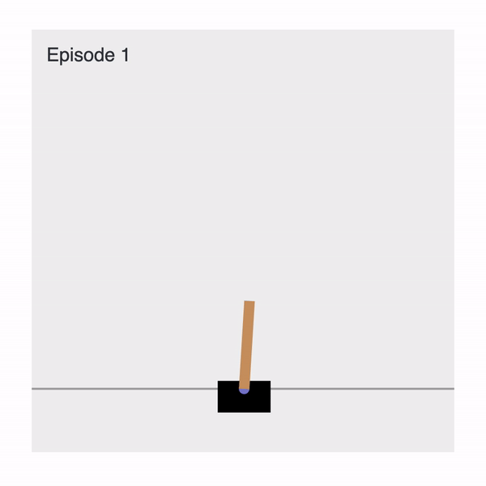

# Environments



These are the main, **integrated environments** of the `rl-ts` package that are maintained. To create an environment and step through it and render the environment:

```js
const RL = require('rl-ts');
const env = new RL.Environments.Examples.CartPole();

const main = async () => {
  for (let episode = 0; episode < 100; episode++) {
    let state = env.reset();
    while (true) {
      const action = env.actionSpace.sample();
      const { reward, observation, done, info } = env.step(action);
      state = observation;
      await env.render('web', { fps: 60, episode });
      if (done) break;
    }
  }
};
main();
```

This will automatically open up a webpage that renders the classical CartPole environment at ~60 fps at every step.

Note that when rendering, it is highly recommended to use await / async to then wait for the render to finish before stepping forward, otherwise there may be visual glitches.

There are some small *caveats* to keep in mind when using these environments. All of these environments use only NdArrays from the [numjs](https://github.com/nicolaspanel/numjs) package instead of javascript arrays or tensorflow tensors. The only other value that is isallowed are scalar numbers. Therefore actions fed into the environment must first be converted to an NdArray or a number. Moreover, any kind of observation and data coming out of the environment will also be an NdArray or number. For example, the CartPole environment returns a 4D NdArray (vector) as observations and accepts numbers as actions.

3rd party environments have no such gurantee but sticking to NdArrays is highly recommended as it will work out of the box with every baseline algorithm (e.g. DQN) and tool in this repo.

## Rendering

The `env.render(mode: string, configs?: any)` is an async function that will render the environment.

The first argument is the render mode, of which there are two kinds, `'ansi'` and `'human'`. When it is `'ansi'`, the environment will be rendered to the terminal. When it is `'human'`, a web based viewer will be initialized. A new page with a renderer will automatically open that then renders the environment state.

The second argument is an optional configurations object `{}`. For most environments, `configs.fps` can be used to set the `fps` of the renderer. Some environments accept additional fields in the configurations to configure the rendering. For example, the CartPole environment allows `configs.episode` and `configs.rewards` to then display those numbers.

## Creating an Environment Renderer

To render to terminal, simply use `console.log` or any terminal printing functions to visualize the environment.

To make a web based viewer (the `'human'` render mode), the following is necessary:

1. Initialize the viewer
2. Update the viewer
3. Create the html and js for rendering

First is the following initialization snippet that goes into the `env.render(mode, configs)` function:

```js
if (mode === 'web') {
  if (!this.viewer.isInitialized()) await this.viewer.initialize(distpath, path);
}
```

This checks the render mode is human, then starts a server at `http://localhost:3000/` and automatically opens `http://localhost:3000/{page}`. Files are served from the `distpath` directory. `distpath` should be an absolute path.

After initialization, we update the viewer as follows

```js
const delay = 1 / (configs.fps / 1000);
await this.sleep(delay);
await this.updateViewer(state, info);
```

State can be anything but it is recommended to be the full state. Info can be an object with information about the environment. `state` and `info` will be sent to the webpage via websockets using the socket.io package.

To create the html and js and make it work with the environment, you can first copy [index.html]() and [sketch.js]() from the CartPole environment as a template. This tutorial uses the [p5js](https://p5js.org/) library to render the environment.

In [index.html](), it will automatically await for `state` and `info` sent to it. Upon receiving updates, it will call `update(state, info)`, where `update` is a function that you will need to define. An example `update` function is defined in [sketch.js]().
